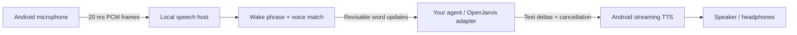

# JVoice

A native Android voice node for an AI network. JVoice streams microphone audio to a local speech host, sends verified words to an agent while you are still talking, and speaks the agent's incoming text before its response is finished.

**Status: functional Android-first prototype.** The Android app, speech host, controller API, demo agent, and OpenJarvis-compatible adapter are implemented. Speech recognition and voice matching run on your host in this version. This is not yet an on-phone inference implementation or an iOS app.



## What works

- A user-defined wake phrase, detected in streaming ASR hypotheses. No wake-word training service or cloud subscription is needed.
- Five-second voice enrollment, local speaker embeddings, and a verification gate before any transcript is sent to an agent. Verification is repeated for each utterance.
- Continuous, stateful streaming ASR using sherpa-onnx Zipformer. Words are emitted during speech; changes carry explicit revisions. A trailing unfinished word is held until the next word boundary or the final endpoint.
- Full-duplex WebSockets: an agent can speak while the user is still speaking. Verified new speech cancels playback; controllers can also cancel immediately.
- Native Android TTS consumes arriving text in small word groups. A 180 ms flush timer avoids waiting for a sentence; incomplete token fragments remain buffered until a word boundary. Playback reports started, done, stopped, or error.
- A visible microphone foreground service, Android echo cancellation when available, bounded queues, pairing authentication, and TLS support. The phone stores neither audio nor the pairing secret on disk.
- A standalone test agent, a real WAV replay client, a Python integration API, and an OpenJarvis-compatible streaming adapter.

## Start the host

Use Python 3.11+ on a machine reachable by the phone. Commands below run from this directory.

```bash
python3 -m venv .venv
source .venv/bin/activate
pip install -e '.[speech,test]'
python scripts/download_models.py
export JVOICE_TOKEN="$(python -c 'import secrets; print(secrets.token_urlsafe(24))')"
python -c 'import os; print(os.environ["JVOICE_TOKEN"])'
jvoice-host
```

Copy the generated token into the phone's **Pairing secret** field. Use the same token in any agent terminal. The model download is roughly 100 MB; weights are separate from the source and are checksum-verified. After this setup, the speech host runs offline.

The host defaults to `127.0.0.1:8765`. For a USB-connected development phone:

```bash
adb reverse tcp:8765 tcp:8765
```

Keep the app's default URL: `ws://127.0.0.1:8765/v1/node`. An Android emulator can instead reach the host at `ws://10.0.2.2:8765/v1/node`.

For a trusted development LAN, start `jvoice-host --bind 0.0.0.0` and enter `ws://YOUR_HOST_IP:8765/v1/node`. Debug builds allow cleartext connections. Release builds require `wss://` and a certificate trusted by Android:

```bash
jvoice-host --bind 0.0.0.0 --cert fullchain.pem --key privkey.pem
```

The pairing token grants access to every node on this reference host, including enrollment and playback. Use one host/token per trust group. It is not multi-tenant authorization.

## Build and use Android

Requires Android Studio or JDK 17+ with Android SDK 36. Minimum device version is Android 8 (API 26).

```bash
cd android
./gradlew :app:assembleDebug
adb install -r app/build/outputs/apk/debug/app-debug.apk
```

1. Open **JVoice**, enter the host URL and pairing secret, and choose a node name and wake phrase.
2. Tap **Connect microphone** and grant microphone permission.
3. Tap **Enroll my voice**. Speak naturally for five seconds. Enrollment times out after 15 seconds if there is insufficient speech. Re-enrollment replaces the existing profile only after a new embedding is ready.
4. Start the demo controller in another terminal with the same `JVOICE_TOKEN`:

   ```bash
   source .venv/bin/activate
   jvoice-agent --node android --mode demo
   ```

5. Say “Hey Jarvis, what time is it?” Watch words appear before the sentence ends. The demo responds when “time” arrives, or after three words, and sends its response incrementally.
6. Tap **Stop speaking** to cancel a reply or **Disconnect microphone** to end the connection. The notification also has a disconnect action.

The phone streams **all microphone audio while connected**, including before a wake phrase. Only verified, activated transcript text reaches the agent. Voice profiles remain in `profiles/<node>.json` on the host; delete that file while disconnected to forget a voice. Raw audio is held briefly in memory and is not recorded by the host.

An offline English voice must be installed in Android's text-to-speech settings. Different installed engines have different latency and prosody. This implementation queues short native utterances; it does not promise a seamless neural audio stream. Headphones are recommended for initial testing of simultaneous listening and speaking.

## Connect OpenJarvis or another AI system

[OpenJarvis documents a streaming chat-completions endpoint](https://open-jarvis.github.io/OpenJarvis/architecture/design-principles/). With that server running:

```bash
jvoice-agent --node android --mode openjarvis \
  --base-url http://127.0.0.1:8000/v1 --model qwen3:8b
```

Use a model actually available on your server. `JVOICE_AI_KEY` optionally sets an API bearer token. Compatible chat-completion servers can use the same adapter.

This adapter starts a request after at least three completed words and a 350 ms pause in transcript updates. Every changed hypothesis cancels the old request and playback. New model tokens are forwarded immediately. Both settings are configurable through `--min-words` and `--debounce-ms`.

**An ordinary chat-completions request cannot accept more user text after it starts.** The adapter therefore cancels and restarts speculative requests; it does not pretend to append input to one ongoing model invocation. The demo has no tool execution, and the bridge exposes no tools. Read `docs/architecture.md` before connecting partial transcripts to agents that cause side effects. OpenJarvis itself has not been run in the local verification; the compatible HTTP/SSE adapter is tested with a controlled stream.

For your own agent, use `jvoice.client.connect_agent` and `agent.speech()`; see [the example](examples/custom_agent.py). The [protocol](docs/protocol.md) is language-independent. WebSocket is the continuous event channel here. An MCP server can wrap the host for discovery/control, but an MCP gateway is not included in this first version.

## Test

```bash
pytest -q
python scripts/smoke_speech.py
cd android
./gradlew :app:testDebugUnitTest :app:lintDebug :app:assembleDebug
```

The model smoke test downloads a real speech fixture and checks that verified partial transcripts appear before the recording ends. It uses the same recording for the voice profile, so it is **not** an evaluation of speaker-verification accuracy. See [verification results](docs/verification.md) for the checks actually performed.

With the phone connected, `python scripts/smoke_playback.py` verifies that native playback starts before the rest of a response is sent. It uses the same `JVOICE_TOKEN` and defaults to node `android`.

To test with your own mono, 16 kHz, PCM16 WAV recordings without a phone:

```bash
jvoice-replay enrollment.wav --node test --enroll
jvoice-agent --node test --mode demo
# In another terminal:
jvoice-replay command.wav --node test --keyword 'hey jarvis'
```

Use a different command recording containing your wake phrase. The replay client prints speech commands instead of playing them, so you can inspect the network exchange.

## Boundaries of this version

- Android is implemented; iOS and on-device speech inference are future work. The wire protocol does not depend on Android.
- The reference models and word segmentation target English. Other languages require suitable streaming models and tokenizer adjustments.
- Wake detection uses the streaming recognizer, not a separate low-power keyword model. Unknown names may be hard to recognize. Audio capture and a wake lock consume battery while connected.
- Voice matching first needs at least 1.2 seconds of energy-qualified speech and may need more before reaching the threshold. It uses a simple energy filter, not a neural VAD. Enrollment/verification thresholds need evaluation for each environment.
- Speaker matching is a convenience gate, not secure authentication or replay detection. Verification latches for one ASR utterance; overlapping speakers and a mid-utterance speaker change are not separated.
- Complete-word detection conservatively holds the decoder's rightmost word. It can introduce one-word delay, plus model lookahead, transport, and verification latency. Words already emitted can still be revised.
- Hardware echo cancellation, Bluetooth routing, battery restrictions, noisy rooms, and long-duration operation require physical-device testing. There is no silent background restart or automatic reconnection; network failure stops capture visibly.
- The reference host serializes model calls and is intended for a few development nodes. It has bounded transport queues, not production admission control or per-user rate limits.

MIT-licensed project source; dependencies and downloaded model weights retain their own terms. See [THIRD_PARTY.md](THIRD_PARTY.md).
